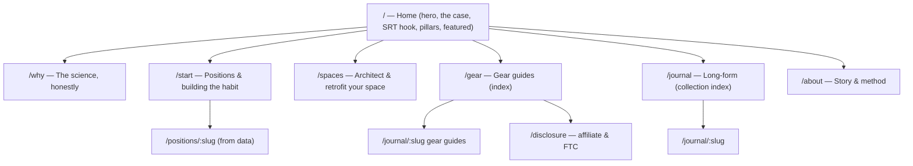
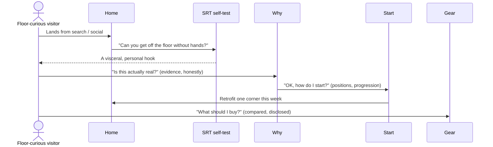
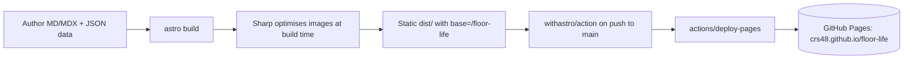

# Floor Life — A Website For The Art & Science Of Floor Living

## Problem Statement

We want to build **Floor Life**, a static website (Astro + Tailwind CSS,
deployed to GitHub Pages) devoted to the beauty and the benefits of
**floor living** — organising a Western home, studio, or apartment
around living closer to the ground instead of around chairs and tall
furniture.

The Western world is, uniquely, a *chair culture*. Roughly two-thirds of
the world still sits, eats, works, and rests on the floor, and our
furniture is quietly at odds with the mobility our bodies evolved to
keep. The site should:

1. **Make the case** — beautifully and *honestly* — for spending more of
   the day at floor level: the mobility, the frequent getting-up-and-down,
   the way the body meets firmer surfaces, the longevity signal in the
   research.
2. **Show people how to start** — floor-sitting positions, how to build
   tolerance gradually, how to make the floor inviting rather than
   punishing.
3. **Help retrofit real Western rooms** — you don't have to throw out
   your furniture; you can make an existing space more floor-friendly
   (a cross-legged desk chair, a chabudai, a reading corner on a rug).
4. **Compare the gear** — floor desks, futons, cushions, zafus, kneeling
   benches, cross-legged office chairs — eventually with affiliate links.
5. **Be a genuinely lovely place to be** — charming, warm, inviting, and
   useful to both the floor-curious beginner and the seasoned
   practitioner going deeper.

## Executive Summary

- **Greenfield repo.** There is no application code yet — only the
  `.claude/` skills. Everything below is built from zero.
- **Stack:** Astro (install `@latest`) + Tailwind CSS **v4** (via the
  `@tailwindcss/vite` plugin — the old `@astrojs/tailwind` integration is
  deprecated) + Markdown/MDX **Content Collections** with Zod-typed
  frontmatter, deployed to **GitHub Pages** via the `withastro/action`
  GitHub Actions workflow. No server, no database — fully static.
- **Design language:** warm, grounded, wabi-sabi / Muji-adjacent — cream
  paper, clay & terracotta, sage & olive, tatami straw, warm ink. A soft
  display serif (Fraunces) over a humanist sans (Nunito Sans). Lots of
  negative space (Japanese *ma*), botanical line-work, gentle grain.
- **Content architecture:** four pillars — **Why** (the science, told
  honestly), **Start** (positions & building the habit), **Spaces**
  (architecting & retrofitting rooms), and **Gear** (product guides) —
  plus a long-form **Journal** (Content Collection) and an **About**.
- **Honesty is the brand.** The strongest floor-living claims (the
  Sitting–Rising Test → mortality signal; hip/ankle mobility;
  squat-assisted digestion) sit next to real caveats (knee-OA risk from
  *prolonged* deep flexion; joint-replacement precautions; "gluteal
  amnesia" is marketing for disuse weakness). We present a *myths vs
  evidence* stance rather than wellness hype — it is more trustworthy and
  more interesting.
- **Recommendation:** build the site now, content-first, with a small set
  of gorgeous cornerstone pages and a handful of real Journal entries and
  gear guides; wire up the GitHub Pages deploy; leave affiliate URLs as
  clearly-marked placeholders with a compliant `<AffiliateLink>`
  component and an FTC disclosure.

## Current State In The Repository

This is a **greenfield repository**. `git ls-files` shows only:

```
.claude/skills/explore/SKILL.md
.claude/skills/implement/SKILL.md
.claude/skills/implement/driver.mjs
```

- No `package.json`, no `src/`, no build tooling.
- Git remote is `https://github.com/crs48/floor-life.git` — so the
  natural GitHub Pages target is a **project page** at
  `https://crs48.github.io/floor-life/` (base path `/floor-life`), with a
  clean upgrade path to a custom domain (`floor.life`) later by dropping
  `base` and adding a `public/CNAME`.
- Toolchain present locally: Node 23, npm 10, pnpm 10. We'll use **npm**
  (simplest for a solo static site; `withastro/action` auto-detects the
  lockfile).

Because nothing exists yet, this exploration doubles as the build spec —
the Implementation Checklist at the end is the actual work plan.

## External Research

### The health & longevity case (told honestly)

**The Sitting–Rising Test (SRT) — the strongest single data point.**
- *2012/2014* (de Brito, Araújo et al., *Eur. J. Prev. Cardiol.*): 2,002
  adults aged 51–80, median 6.3-yr follow-up, 159 deaths. Score 0–10 for
  lowering to and rising from the floor (a point off per hand/knee/other
  support). **Each 1-point increase ≈ 21% better survival**;
  multivariate-adjusted hazard ratios up to **5.44** for the lowest
  scorers vs the highest. ([PubMed 23242910](https://pubmed.ncbi.nlm.nih.gov/23242910/))
- *2025* (Araújo et al., *Eur. J. Prev. Cardiol.*, DOI
  [10.1093/eurjpc/zwaf325](https://academic.oup.com/eurjpc/advance-article/doi/10.1093/eurjpc/zwaf325/8163161)):
  larger (4,282 adults) and longer (median 12.3 yr, 665 deaths). Lowest
  scorers had **~3.8× natural-cause** and **~6× cardiovascular** mortality
  vs perfect scorers. ~10-yr survival: **97%** (score 10) vs **73%**
  (score 0–4).
- **Caveat we will state plainly:** the SRT measures *non-aerobic*
  musculoskeletal fitness (strength, flexibility, balance, body
  composition). It is an *association*; getting on and off the floor is
  not *proven* to cause longer life, and the cohort was a self-selected
  private-clinic population.

**Mobility, positions & biomechanics.**
- A deep resting squat needs ~15–20° ankle dorsiflexion and ~120° hip
  flexion; **ankle dorsiflexion is usually the limiting factor**. Western
  adults mostly lose this range to *disuse* (chairs), not anatomy.
  ([PMC7276781](https://pmc.ncbi.nlm.nih.gov/articles/PMC7276781/))
- Floor-sitting cultures measurably reshape hip ROM (greater flexion &
  external rotation). ([PMC8276444](https://www.ncbi.nlm.nih.gov/pmc/articles/PMC8276444/))
- Each position has a signature demand & caution: cross-legged
  (*sukhasana*) needs hip external rotation or the pelvis tips into a
  slump; seiza (kneeling) compresses lower-leg circulation → pins &
  needles; long-sitting needs hamstring length; side/Z-sit loads
  asymmetrically (alternate sides); W-sit is discouraged for kids.

**Digestion.** Sikirov 2003 (*Dig. Dis. Sci.*): squatting straightened
the anorectal angle and cut time-to-satisfactory-emptying to ~51 s vs
~130 s seated (p<0.0001), with less straining — but a **2025 scoping
review** ([PubMed 40604598](https://pubmed.ncbi.nlm.nih.gov/40604598/))
flags the whole literature as small-sample / low-quality. Real effect,
weak evidence base.

**The central nuance — knees.** Deep flexion is a double-edged sword.
The Beijing Osteoarthritis Study (Zhang 2004,
[PubMed 15077301](https://pubmed.ncbi.nlm.nih.gov/15077301/)) and a
Thailand cohort ([PubMed 16980903](https://pubmed.ncbi.nlm.nih.gov/16980903/))
tie *prolonged, high-volume* squatting/cross-legged/side-sitting to
**more** knee OA (adjusted OR ~2.0–2.4). Mobility benefit and joint risk
**coexist** — so we preach *variety, moderation, and pain-free range*,
not marathon squat-holds.

**Longevity culture.** Blue Zones attributes part of Okinawan longevity
to minimal furniture and floor living — residents get up and down "dozens
of times a day" ([Blue Zones](https://www.bluezones.com/2020/07/why-the-okinawan-practice-of-sitting-on-the-floor-is-linked-to-health-mobility-and-longevity-how-you-can-practice-it-at-home/)).
A hypothesised contributing mechanism, not an isolated tested variable.
Parallel hard evidence: grip strength predicts mortality too — functional
strength markers track survival.

**Movement philosophy (label it as philosophy).** Katy Bowman's
*Nutritious Movement* / `#furniturefree` "dynamic living space," Ido
Portal's Movement Culture (~30 min/day in a resting squat — in tension
with the knee-OA data), MovNat's natural movement. Coherent,
evolution-flavoured, thin on controlled trials — genuinely useful framing,
honestly labelled.

**Myths we will not repeat uncritically.** "Gluteal amnesia / dead-butt"
is disuse weakness or gluteal tendinopathy, not muscles literally
forgetting; the dramatic Nachemson "sitting doubles disc pressure"
numbers are partly superseded; floor sitting burns *some* extra calories
but modest (single-digit %), mostly in the lower limb, not the core;
"dynamic sitting cures back pain" is unproven as a standalone.

### The gear landscape

- **Floor seating:** zafu + zabuton (meditation cushion + mat), floor
  chairs with back support, Japanese legless *zaisu* chairs, seiza /
  kneeling benches, meditation stools, bolsters, floor sofas & modular
  cushion systems.
- **Cross-legged / kneeling desk chairs:** ergonomic kneeling chairs
  (e.g. Varier Variable), saddle stools, and the specific niche the owner
  described — a chair with a lower bench for the knees that lets you sit
  cross-legged at a *standard-height* desk. The flagship real product is
  the **Soul Seat** by Ikaria Design Co. (two-tier perch, backless,
  ~US$1,278) — confirmed, and a perfect anchor for a comparison.
- **Low desks:** Japanese *chabudai* low tables, *kotatsu*, lap desks,
  height-adjustable floor desks.
- **Floor sleeping:** Japanese *shikibuton* futon, tatami platforms,
  roll-up bedding to reclaim space.
- **Underfoot:** tatami, cork, wool rugs, layered rugs, foam/jigsaw play
  mats, warmth & cushion strategy.
- **Props:** yoga bolsters, blocks, wedges, squat/slant boards, knee
  pads, back-support cushions.

Affiliate programs typically exist via Amazon Associates and brand-direct
schemes. We model gear as a **data collection**; every outbound buy link
is a reusable `<AffiliateLink>` emitting `rel="sponsored nofollow"` with a
**clear, conspicuous FTC disclosure above the links** (footer-only is not
enough for pages landed on from search).

### Prior art & aesthetic references

Katy Bowman / Nutritious Movement (`#furniturefree`), The Ready State
(Kelly Starrett, "your best posture is your next posture"), r/floorliving,
Japanese interior minimalism, Muji, *wabi-sabi*, *ma* (negative space),
Scandinavian and biophilic design. The tone to beat: most floor-living
content is either dry PT-blog or breathless wellness. **Our lane:
charming, editorial, evidence-honest, and practical.**

### Technical stack notes

- **Astro** — install `@latest`. Content Collections are stable and use
  the **Content Layer** loaders (`glob()` for MD/MDX, `file()` for JSON
  data); config lives at `src/content.config.ts` with Zod schemas.
- **Tailwind CSS v4** — install `tailwindcss` + `@tailwindcss/vite`; add
  the plugin under `vite.plugins` (NOT `integrations`); `@import
  "tailwindcss";` in one global stylesheet imported from the base layout.
  Design tokens live in CSS via `@theme` (no `tailwind.config.js`);
  `@plugin "@tailwindcss/typography";` for `prose`.
- **GitHub Pages** — set `site: 'https://crs48.github.io'` and `base:
  '/floor-life'`. Internal links & manual asset `src`s **must** include
  the base — build them through one `withBase()`/`href()` helper using
  `import.meta.env.BASE_URL`. Astro `<Image>` and imported assets handle
  base automatically. `withastro/action` writes `.nojekyll` for us.
  Custom-domain upgrade later = drop `base`, add `public/CNAME`.
- **Supporting integrations:** `@astrojs/mdx`, `@astrojs/sitemap`,
  `@astrojs/rss`, `@tailwindcss/typography`, `sharp` (build-time image
  optimisation), Fontsource variable fonts. `client:*` islands only where
  genuinely interactive (keep it near-zero JS).

## Key Findings

1. **Honesty is a feature, not a constraint.** The evidence is strong
   enough to be compelling *and* nuanced enough to be interesting. A
   "myths vs evidence" voice differentiates us from every hype site.
2. **The SRT is the hook.** A single, visceral, do-it-now test with a
   real mortality signal is the perfect front-door interactive.
3. **Retrofit, don't evangelise.** Most Westerners won't go furniture-free
   overnight. "Make *one* corner floor-friendly" is a kinder, stickier
   on-ramp than "throw out your couch."
4. **Static is more than enough.** No user accounts, no cart — content,
   comparisons, and outbound links. Astro's zero-JS-by-default is ideal
   for a fast, beautiful, cheap-to-host editorial site.
5. **The gear section is a slow burn.** Ship the framework (data model,
   card, comparison table, compliant affiliate component, disclosure) now;
   fill real products/links over time.

## Options And Tradeoffs

### Framework

| Option | Pros | Cons | Verdict |
|---|---|---|---|
| **Astro** | Content-first, islands, zero-JS default, first-class MD/MDX collections, great image pipeline, trivial GH Pages deploy | Another toolchain to learn | ✅ **Chosen** — exactly what an editorial static site wants |
| Next.js (static export) | Familiar React | Heavier, more JS, awkward pure-static | ❌ Overkill |
| Eleventy | Very light | Less batteries-included, weaker image/asset story | ➖ Fine, but Astro wins on DX |
| Plain HTML/Hugo | Fast | Poor component ergonomics / MDX authoring | ❌ |

### Styling

| Option | Verdict |
|---|---|
| **Tailwind v4 + `@theme` tokens + typography plugin** | ✅ Chosen — fast, tokenised, great `prose` for long-form |
| Vanilla CSS / Open Props | ➖ Nice but slower to build a full design system |
| UI kit (DaisyUI etc.) | ❌ Fights the bespoke wabi-sabi look |

### Hosting / base path

| Option | Verdict |
|---|---|
| **GH Pages project page, `base:/floor-life`** | ✅ Chosen now — zero cost, matches the repo |
| Custom domain `floor.life` | ⏭️ Easy later upgrade (drop base + CNAME) |
| Netlify/Vercel | ➖ Fine, but GH Pages is what was asked for |

### Content model

| Content | Model |
|---|---|
| Long-form articles | `journal` collection — MD/MDX via `glob()` |
| Floor positions | `positions` collection — JSON via `file()` |
| Products | `products` collection — JSON via `file()` |
| Cornerstone pages (Why/Start/Spaces/Gear index) | `.astro` pages composing components |

### Information architecture



### Reader journey



### Build & deploy pipeline



## Recommendation

Build **Floor Life** now as an Astro + Tailwind v4 static site, deployed
to GitHub Pages, with:

1. A **warm, wabi-sabi design system** (tokens, fonts, base layout, nav,
   footer) that feels like a beautifully-made paper zine.
2. **Four cornerstone pages** — Why / Start / Spaces / Gear — plus a
   **Journal** collection and **About**.
3. An **SRT interactive** as the home-page hook (a tiny, tasteful island).
4. **Positions** and **products** as typed data collections, rendered
   through reusable cards and a comparison table.
5. A **compliant affiliate layer** (`<AffiliateLink>` + `/disclosure`)
   with placeholder links, ready to monetise later.
6. **Honesty baked in** — every strong claim paired with its caveat, a
   dedicated *myths vs evidence* treatment, and cited sources.
7. **CI deploy** via `withastro/action`, base path handled through one URL
   helper, custom-domain upgrade documented.

Ship the framework and enough real, lovely content to stand on its own;
grow the Journal and Gear over time.

## Example Code

`astro.config.mjs`:

```js
// @ts-check
import { defineConfig } from 'astro/config';
import mdx from '@astrojs/mdx';
import sitemap from '@astrojs/sitemap';
import tailwindcss from '@tailwindcss/vite';

export default defineConfig({
  site: 'https://crs48.github.io',
  base: '/floor-life',
  trailingSlash: 'ignore',
  integrations: [mdx(), sitemap()],
  vite: { plugins: [tailwindcss()] },
});
```

`src/styles/global.css` (token excerpt):

```css
@import "tailwindcss";
@plugin "@tailwindcss/typography";

@theme {
  --font-display: "Fraunces Variable", ui-serif, Georgia, serif;
  --font-body: "Nunito Sans Variable", ui-sans-serif, system-ui, sans-serif;

  --color-paper: #f7f1e6;   /* warm cream */
  --color-ink: #2c2620;     /* warm near-black */
  --color-clay: #b8683f;    /* terracotta accent */
  --color-sage: #7c8768;    /* olive/sage */
  --color-straw: #d9c4a0;   /* tatami */
}
```

`src/lib/url.ts` (the one base-path helper):

```ts
const BASE = import.meta.env.BASE_URL.replace(/\/$/, '');
export function href(path = '/') {
  const p = path.startsWith('/') ? path : `/${path}`;
  return `${BASE}${p}` || '/';
}
```

## Risks And Open Questions

- **Health claims / liability.** We are not giving medical advice. Every
  strong claim is caveated, sources are cited, and a short "not medical
  advice; build up gradually; consult a professional" note appears where
  appropriate.
- **Astro/Tailwind version drift.** Research suggests Astro may be on v7
  and Tailwind v4.1 by mid-2026. We install `@latest` and let the lockfile
  pin real versions; patterns (collections, `@tailwindcss/vite`, base
  path) are stable across recent majors. Hand-written `.astro` is kept as
  valid HTML in case of stricter parsing.
- **Base-path bugs** are the classic GH Pages failure. Mitigation: a
  single `href()` helper, `<Image>`/imported assets for media, and a
  build-time check that no internal link hardcodes a leading `/` outside
  the helper.
- **GitHub Actions tag drift.** Action major tags may advance; we use
  known-good majors and note they can be bumped.
- **Affiliate content is empty at launch** — intentionally placeholdered
  and clearly disclosed; no fabricated prices/links presented as live.
- **Open question:** custom domain `floor.life` now or later? Default:
  later (documented upgrade path).

## Implementation Checklist

- [x] Scaffold the project: `package.json` (scripts: `dev`, `build`,
      `preview`), `astro.config.mjs` (`site` + `base` + mdx + sitemap +
      tailwind vite plugin), `tsconfig.json`, `.gitignore`, `.nvmrc`
- [x] Install dependencies (`astro`, `@astrojs/mdx`, `@astrojs/sitemap`,
      `@astrojs/rss`, `tailwindcss`, `@tailwindcss/vite`,
      `@tailwindcss/typography`, `sharp`, Fontsource Fraunces + Nunito
      Sans) and verify a clean `npm install`
- [ ] Build the design system: `src/styles/global.css` with `@theme`
      tokens (paper/ink/clay/sage/straw, display + body fonts), base
      typography, and `prose` styling
- [ ] Add the `href()` base-path helper (`src/lib/url.ts`) and site
      config/constants (`src/lib/site.ts`: title, description, nav, social)
- [ ] Create `BaseLayout.astro` with a reusable `<Head>`/SEO partial
      (title, description, canonical, Open Graph, sitemap) importing the
      global stylesheet
- [ ] Build site chrome: `Header`/nav (with mobile menu island) and
      `Footer`, using `href()` for every internal link
- [ ] Define Content Collections in `src/content.config.ts`: `journal`
      (glob MD/MDX) + `positions` (file JSON) + `products` (file JSON),
      each with a Zod schema
- [ ] Build reusable components: `SectionHeader`, `Prose`, `Callout`,
      `BenefitCard`, `PositionCard`, `ProductCard`, `ComparisonTable`,
      `AffiliateLink` (emits `rel="sponsored nofollow"`), `Newsletter` CTA
- [ ] Home page (`/`): hero, "the case", the **SRT self-test** interactive
      island, the four pillars, featured Journal, gentle CTA
- [ ] Why page (`/why`): the science told honestly — SRT stats, mobility,
      digestion, the knee caveat, myths-vs-evidence, cited sources
- [ ] Start page (`/start`): building the habit + the positions gallery
      rendered from the `positions` collection, with cues & cautions
- [ ] Positions detail route (`/positions/[slug]`) generated from data
- [ ] Spaces page (`/spaces`): architecting & retrofitting Western rooms
      (one-corner on-ramp, room-by-room, the cross-legged-desk retrofit)
- [ ] Gear index (`/gear`): categories, `ProductCard`s + a
      `ComparisonTable` (anchored by the Soul Seat), disclosure banner
- [ ] Disclosure page (`/disclosure`): affiliate + FTC + not-medical-advice
- [ ] Journal index (`/journal`) + article route (`/journal/[slug]`) using
      the `Prose` layout, with at least 3 real MD/MDX entries (incl. one
      gear guide and one "myths vs evidence" piece)
- [ ] About page (`/about`) and a styled 404 page
- [ ] Feeds & SEO: `rss.xml` endpoint, `robots.txt`, `sitemap` integration
      wired, social/OG image
- [ ] Seed real content: `positions.json` (≥5 positions), `products.json`
      (≥4 products incl. Soul Seat), and the Journal entries above
- [ ] GitHub Actions deploy workflow (`.github/workflows/deploy.yml`)
      using `withastro/action`
- [ ] Project `README.md` (dev/build/deploy, base-path & custom-domain
      notes) and license

## Validation Checklist

- [ ] `npm install` completes cleanly and `npm run build` exits 0
- [ ] `dist/` contains all expected routes (home, why, start, spaces,
      gear, disclosure, journal + entries, positions + entries, about,
      404, rss.xml, sitemap, robots.txt)
- [ ] No internal link/asset 404s under the `/floor-life` base — every
      internal link goes through `href()`; assets use `<Image>`/imports
- [ ] `astro build` emits no unresolved-image or schema errors; Zod
      schemas validate the seeded JSON data
- [ ] Pages carry correct `<title>`, meta description, canonical, and OG
      tags; sitemap and RSS reference absolute URLs via `site`
- [ ] `preview` server renders the site; SRT interactive works; mobile nav
      opens; layout holds at mobile/tablet/desktop widths
- [ ] Every affiliate link renders `rel="sponsored nofollow"` and the FTC
      disclosure is visible above the links
- [ ] Deploy workflow is valid YAML with the correct `pages`/`id-token`
      permissions and triggers on push to `main`

## References

- Sitting–Rising Test 2012/2014 — [PubMed 23242910](https://pubmed.ncbi.nlm.nih.gov/23242910/)
- Sitting–Rising Test 2025 — [EJPC / DOI 10.1093/eurjpc/zwaf325](https://academic.oup.com/eurjpc/advance-article/doi/10.1093/eurjpc/zwaf325/8163161)
- Deep squat mobility requirements — [PMC7276781](https://pmc.ncbi.nlm.nih.gov/articles/PMC7276781/)
- Cross-cultural hip ROM — [PMC8276444](https://www.ncbi.nlm.nih.gov/pmc/articles/PMC8276444/)
- Squatting & defecation (Sikirov 2003) — [Springer](https://link.springer.com/article/10.1023/A:1024180319005) · 2025 scoping review [PubMed 40604598](https://pubmed.ncbi.nlm.nih.gov/40604598/)
- Beijing Osteoarthritis Study (squatting & knee OA) — [PubMed 15077301](https://pubmed.ncbi.nlm.nih.gov/15077301/) · Thailand cohort [PubMed 16980903](https://pubmed.ncbi.nlm.nih.gov/16980903/)
- Blue Zones / Okinawa floor sitting — [Blue Zones](https://www.bluezones.com/2020/07/why-the-okinawan-practice-of-sitting-on-the-floor-is-linked-to-health-mobility-and-longevity-how-you-can-practice-it-at-home/)
- Katy Bowman / Nutritious Movement (furniture-free) — [nutritiousmovement.com](https://www.nutritiousmovement.com/)
- The Soul Seat (cross-legged office chair) — [Ikaria Design Co.](https://www.ikariadesign.com/)
- Astro Content Collections — [docs.astro.build](https://docs.astro.build/en/guides/content-collections/)
- Tailwind + Astro (v4, `@tailwindcss/vite`) — [tailwindcss.com](https://tailwindcss.com/docs/installation/framework-guides/astro)
- Deploy Astro to GitHub Pages — [docs.astro.build](https://docs.astro.build/en/guides/deploy/github/)
- Affiliate `rel` & FTC disclosure — [Google rel guide](https://developers.google.com/search/docs/crawling-indexing/qualify-outbound-links) · [FTC endorsement guides](https://www.ftc.gov/business-guidance/resources/ftcs-endorsement-guides-what-people-are-asking)
