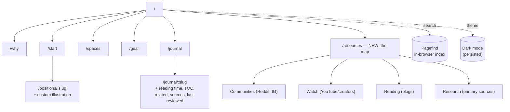
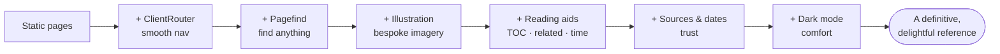
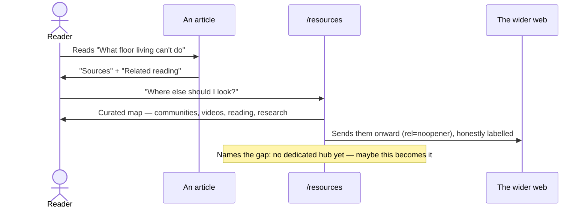

# Making Floor Life Definitive — Resources, Imagery & Delight

## Problem Statement

The first build ([0001](0001_[x]_FLOOR_LIVING_WEBSITE.md)) shipped a
complete, beautiful, evidence-honest Floor Life site. It stands on its
own — but it is text-and-SVG only, self-contained, and quiet. To become
*the definitive* floor-living resource (and a delight to move through),
it should:

1. **Point outward, generously.** Curate the best of the floor-living
   internet — Reddit communities, YouTube channels, standout blog posts,
   the primary research — in a proper **Resources / Library** hub. Prior
   art shows the topic is scattered across a dozen adjacent communities
   with **no dedicated home**; being the trustworthy map is a real,
   unclaimed position.
2. **Look richer.** Add imagery — but *bespoke*, not stock-y. The
   strongest, most on-brand, most build-safe move is a cohesive
   **custom line-art illustration** system (one per floor position, plus
   scenes), while wiring an `astro:assets` pipeline so real photography
   can be dropped in later.
3. **Feel definitive and cohesive.** Add the connective tissue a
   reference site needs: **on-site search**, **smooth view transitions**,
   **reading time + table of contents + related reading + cited sources**
   on articles, **"last reviewed" dates**, and a tasteful **dark mode** —
   all without breaking the static, near-zero-JS, GitHub Pages model.

## Executive Summary

- **Build on 0001, don't rebuild.** Everything here is additive to the
  existing Astro 5 + Tailwind v4 site.
- **Resources hub** as a typed `resources` data collection → a curated,
  grouped `/resources` page (communities · watch · reading · research),
  with an honest "there is no dedicated hub yet — here's the map" frame.
- **Imagery = custom SVG illustration** (deterministic, zero-licensing,
  perfectly on-brand wabi-sabi line-art) as the primary answer, *plus* an
  `astro:assets` `<Image>` + `<Figure>` pipeline and documented
  Unsplash/Pexels workflow for real photos later.
- **Delight layer:** Pagefind search, Astro `<ClientRouter />` view
  transitions, journal reading-time/TOC/related/sources, "last reviewed"
  trust signals, and a warm dark mode with a no-flash toggle.
- **Honesty holds:** external links are curated and labelled; nothing
  fabricated; the community gap is named rather than papered over.

## Current State In The Repository

The site from 0001 is live at `https://crs48.github.io/floor-life/`.
Relevant seams this work touches:

- Layout & chrome — `src/layouts/BaseLayout.astro`,
  `src/components/Header.astro`, `src/components/Footer.astro`.
- Design system — `src/styles/global.css` (`@theme` tokens: paper, ink,
  clay, sage, straw; a fixed grain overlay; `.prose-floor`).
- Nav / identity — `src/lib/site.ts` (`nav`, `footerNav`), base-path
  helper `src/lib/url.ts` (`href()`).
- Content — `src/content.config.ts` (`journal` glob + `positions` /
  `products` JSON), data in `src/data/`, articles in
  `src/content/journal/`.
- Illustration today — inline SVGs only: the home motif in
  `src/pages/index.astro`, the icon set in `src/components/Icon.astro`,
  and `public/favicon.svg` / `public/og.svg`.
- Interactivity today — small vanilla scripts in `Header.astro`
  (mobile menu), `SitRiseTest.astro`, `Newsletter.astro`. **These run at
  first load only**; adding view transitions means re-initialising them
  on `astro:page-load`.

No search, no image pipeline, no dark mode, no external-links page yet —
all greenfield additions.

## External Research

### The community landscape (and the gap)

Confirmed by research in 0001 and re-verified here: **there is no
dedicated, active "floor living" community hub.** A search for
`r/floorliving` returns nothing indexed; the conversation lives inside
adjacent communities. That absence is the single clearest opportunity —
Floor Life can be the map, and eventually the meeting place.

Real, active communities worth linking (large, confident):

- **r/simpleliving**, **r/minimalism**, **r/malelivingspace** — the
  furniture-free / "got rid of my couch" conversation.
- **r/Mobility**, **r/flexibility**, **r/bodyweightfitness** — the
  get-up-and-down, deep-squat, hip-and-ankle side.
- **r/yoga**, **r/Posture**, **r/japanlife** — floor postures, sitting,
  and tatami/expat living.
- **r/furniturefree** — small and niche, but the closest to on-topic;
  label it honestly as tiny.

Instagram carries the aesthetic: **#furniturefree**, plus Katy Bowman
(**@nutritiousmovement**) and Tony Riddle (**@thenaturallifestylist**).

### Voices worth watching (YouTube / creators)

- **Nutritious Movement — Katy Bowman** ([nutritiousmovement.com](https://www.nutritiousmovement.com/)):
  the furniture-free canon and floor-sitting transitions.
- **The Ready State — Kelly Starrett** ([thereadystate.com](https://thereadystate.com/), [youtube.com/@thereadystate](https://www.youtube.com/@thereadystate)):
  "your next posture is your best posture," *Built to Move*.
- **GMB Fitness** ([gmb.io](https://gmb.io/), [youtube.com/@GMBFitness](https://www.youtube.com/@GMBFitness)):
  approachable floor mobility, seiza, ground movement.
- **Squat University** ([youtube.com/@SquatUniversity](https://www.youtube.com/@SquatUniversity)):
  the deep squat and ankle/hip mobility, deeply.
- **Upright Health** ([uprighthealth.com](https://uprighthealth.com/)):
  hip mobility and floor-sitting progressions.
- **Tony Riddle — The Natural Lifestylist** ([tonyriddle.com](https://www.tonyriddle.com/)),
  **Ido Portal / Movement Culture** ([idoportal.com](https://www.idoportal.com/)):
  the philosophy of ground living. *(Link official sites; verify exact
  YouTube handles before publishing.)*

### Genuinely good reading (verified live)

- Wander Magazine — [Would You Give Furniture-Free Living a Go?](https://wander-mag.com/articles/live-well/furniture-free-living/)
- Petra Fisher — [Furniture-Free: Real Life Examples](https://www.petrafishermovement.com/furniture-free-style/) · [8 Easy Steps](https://www.petrafishermovement.com/furniture-free/)
- Dwell — [11 Homes That Embrace Wabi-Sabi Design](https://www.dwell.com/article/wabi-sabi-home-design-cd8d61ff)
- Kinfolk — [Home Tour: George Suyama](https://www.kinfolk.com/stories/home-tour-george-suyama/)
- Irasshai — [Living Closer To The Ground](https://irasshai.store/blogs/news/tatami-japandi-ideas) *(a tatami shop's blog — commercial, but on-topic)*
- Apartment Therapy — [I Skipped the Couch](https://www.apartmenttherapy.com/why-i-did-not-buy-a-couch-36978504) · [Floor Seating Ideas](https://www.apartmenttherapy.com/alternative-seating-options-36650215) *(real URLs; AT bot-blocks fetching — click before publishing)*
- Blue Zones — [The Okinawan practice of floor sitting](https://www.bluezones.com/2020/07/why-the-okinawan-practice-of-sitting-on-the-floor-is-linked-to-health-mobility-and-longevity-how-you-can-practice-it-at-home/)
- Harvard Health — [What the Sitting-Rising Test says about your health](https://www.health.harvard.edu/healthy-aging-and-longevity/what-the-sitting-rising-test-says-about-your-health)

Primary research: SRT [2012](https://pubmed.ncbi.nlm.nih.gov/23242910/) ·
[2025](https://academic.oup.com/eurjpc/advance-article/doi/10.1093/eurjpc/zwaf325/8163161).

### Imagery: licensing & the "bespoke vs stock" call

- **Unsplash** (verified 2026): free for commercial use, **no attribution
  required**, irrevocable licence — with real caveats: no recognisable
  faces/trademarks without rights, and you can't compile to replicate a
  competing service. **Pexels** and **Pixabay** are similar.
- The editorial risk is *stock sameness* — the fastest way to look like
  everyone else. The design research for 0001 concluded a wabi-sabi /
  biophilic site wants **hand-drawn, slightly-imperfect line-art** over
  glossy stock.
- Therefore: **lead with custom SVG illustration** (deterministic,
  license-free, on-brand), and keep photography as an optional,
  documented `astro:assets` drop-in — not a build dependency on fetching
  remote binaries during CI.

### Static-site tooling (verified)

- **Search:** [Pagefind](https://pagefind.app/) via
  [`astro-pagefind`](https://github.com/shishkin/astro-pagefind) — a
  build-time index, in-browser query, zero backend, the consensus best
  choice for static Astro sites.
- **View transitions:** Astro `<ClientRouter />` (`astro:transitions`) —
  SPA-smooth nav on a fully static site; scripts must re-init on
  `astro:page-load`.
- **Images:** `astro:assets` `<Image>`/`getImage()` optimise at build via
  Sharp (WebP/AVIF, `srcset`, width/height for zero CLS). Imported local
  assets get the base path automatically; hand-written `src` do not.

## Key Findings

1. **Being the map is the position.** No competitor curates the whole
   floor-living internet honestly. A great Resources hub is high-value and
   uncontested.
2. **Custom illustration beats stock** for this brand *and* is the
   build-safe choice — no licensing, no remote-fetch fragility, perfect
   tonal fit.
3. **The delight features are cheap and compounding.** Search, view
   transitions, reading aids, and dark mode are each small, and together
   they make the site feel like a considered product rather than a
   brochure.
4. **View transitions have one real cost:** existing inline scripts must
   be made navigation-safe (`astro:page-load`). Cheap, but must be done.
5. **Trust scales with citation.** "Last reviewed" dates and per-article
   sources turn a nice blog into a reference.

## Options And Tradeoffs

### Imagery approach

| Option | Pros | Cons | Verdict |
|---|---|---|---|
| **Custom SVG line-art** | On-brand, license-free, deterministic build, tiny, themeable | Authoring effort; not photographic | ✅ **Primary** |
| Real photography via `astro:assets` (committed local files) | Rich, human | Sourcing/licensing effort; can look stock-y; needs curation | ➖ **Wire it, document it, seed later** |
| Remote images at build (`image.domains`) | No repo weight | Build fragility (network/rate-limit on CI), hotlink/licensing risk | ❌ Avoid for CI |
| AI-generated | Fast, bespoke-ish | Licensing/ethics murk on a health site; uncanny | ❌ Not now |

### Search

| Option | Verdict |
|---|---|
| **Pagefind (`astro-pagefind`)** | ✅ Static, free, fast, in-browser |
| Algolia DocSearch | ❌ Hosted, overkill, cost |
| Hand-rolled JSON index | ➖ Reinventing Pagefind |

### Resources page: static list vs. typed collection

| Option | Verdict |
|---|---|
| **Typed `resources` JSON collection** | ✅ Zod-validated, groupable, feeds search & future filtering |
| Hardcoded HTML list | ❌ Unmaintainable, untyped |

### Dark mode

| Option | Verdict |
|---|---|
| **`[data-theme=dark]` token overrides + no-flash inline script + toggle** | ✅ Warm, controllable, persists |
| `prefers-color-scheme` only (no toggle) | ➖ No user control |
| None | ❌ Misses a delight + accessibility win |

### Site map after this work



### Delight layers (what each adds)



### Reader flow into the Resources hub



## Recommendation

Ship an **additive enrichment pass** in this order:

1. **Resources hub** (`/resources`) from a typed `resources` collection —
   the highest-value, most-requested piece.
2. **Custom illustration system** — a cohesive line-art set (positions +
   scenes) used across cards and detail pages, plus the `astro:assets` +
   `<Figure>` pipeline and a documented photo workflow.
3. **Search** (Pagefind) and **view transitions** (`<ClientRouter />`),
   with all inline scripts made navigation-safe.
4. **Journal enrichment** — reading time, table of contents, related
   reading, per-article **sources**, and **last reviewed** dates.
5. **Dark mode** — warm token overrides, no-flash, persisted toggle.
6. **Polish** — print-friendly "start here" cheat sheet, reduced-motion
   respected, nav/footer updated, sitemap covers new routes.

Keep it honest, keep it static, keep it green.

## Example Code

`resources` collection (adds to `src/content.config.ts`):

```ts
const resources = defineCollection({
  loader: file('./src/data/resources.json'),
  schema: z.object({
    title: z.string(),
    url: z.string(),
    kind: z.enum(['community', 'watch', 'reading', 'research']),
    source: z.string(),           // "Reddit", "YouTube", "Wander Magazine"…
    note: z.string(),             // one-line "why link this"
    order: z.number().default(0),
  }),
});
```

No-flash dark-mode head script (inlined before paint):

```html
<script is:inline>
  const t = localStorage.getItem('theme') ??
    (matchMedia('(prefers-color-scheme: dark)').matches ? 'dark' : 'light');
  document.documentElement.dataset.theme = t;
</script>
```

Make an inline island survive view transitions:

```html
<script>
  function initMenu() { /* … wire the toggle … */ }
  document.addEventListener('astro:page-load', initMenu);
</script>
```

## Risks And Open Questions

- **View transitions × inline scripts.** The mobile menu, SRT, newsletter,
  search, and theme toggle must all re-init on `astro:page-load`, or they
  silently die after the first client navigation. Primary risk; must be
  tested by clicking between pages.
- **Dark mode × `color-mix` tokens × grain.** The palette uses
  `color-mix` hairlines and a fixed grain overlay; the dark theme must
  re-derive these so contrast and the grain stay tasteful.
- **Pagefind timing.** The index is generated post-build; verify the
  `astro-pagefind` integration produces `/pagefind/` in `dist` and that
  the UI loads it under the `/floor-life` base path.
- **External link rot & handles.** YouTube @handles and third-party posts
  drift; prefer stable official URLs, add `rel="noopener"`, and keep the
  list in one data file for easy pruning. Apartment Therapy bot-blocks
  fetching (links are real); some YouTube handles need a manual check.
- **Scope.** This is a broad pass — each feature is small, but together
  they touch layout, config, and content. Build must stay green at each
  step.

## Implementation Checklist

- [x] Add a typed `resources` collection to `src/content.config.ts` and
      seed `src/data/resources.json` (communities, watch, reading,
      research — all real, honestly labelled)
- [x] Build the `/resources` hub page: grouped, curated link library with
      an `ExternalLink` component (`rel="noopener"`) and the honest
      "no dedicated hub yet" framing; add **Resources** to nav + footer
- [x] Create a cohesive custom illustration set: `PositionArt.astro`
      (one line-art scene per position slug) and a small shared scene set
- [x] Use the illustrations on `PositionCard`, the positions detail route,
      and the start gallery; refresh the home/pillar motifs for cohesion
- [ ] Wire the image pipeline: `Figure.astro` (caption + credit) over
      `astro:assets` `<Image>`, an `src/assets/` dir, and README notes on
      the Unsplash/Pexels workflow + credits convention
- [ ] Add on-site search with `astro-pagefind`: integration in
      `astro.config.mjs`, a `Search` UI in the header, styled to theme
- [ ] Add view transitions: `<ClientRouter />` in `BaseLayout`, and
      refactor every inline island (menu, SRT, newsletter, search, theme)
      to initialise on `astro:page-load`
- [ ] Journal: compute **reading time** and render a **table of contents**
      from `render()` headings, with in-page anchors
- [ ] Journal: add **related reading** (same category/tags) and a
      per-article **Sources** block + **last reviewed** date (frontmatter
      `updatedDate` / `sources`), and backfill the 4 existing articles
- [ ] Add a warm **dark mode**: `[data-theme=dark]` token overrides in
      `global.css`, a no-flash inline head script, and a header toggle
      that persists to `localStorage`
- [ ] Add a print-friendly **"Start here" cheat sheet** (print CSS on
      `/start` or a dedicated `/cheatsheet`) summarising positions & first
      moves
- [ ] Update `src/lib/site.ts` nav/footer, ensure the sitemap + RSS cover
      new routes, and refresh the README with the new features

## Validation Checklist

- [ ] `npm run build` exits 0 and `astro check` is clean; all new routes
      (`/resources`, any cheat sheet) appear in `dist/` and the sitemap
- [ ] `/resources` renders every curated link with `rel="noopener"`;
      links open correctly and are grouped by kind
- [ ] Pagefind index is emitted to `dist/pagefind/` and search returns
      results in `preview`, loading correctly under the `/floor-life` base
- [ ] With view transitions on, navigating between pages keeps the mobile
      menu, SRT test, newsletter, search, and theme toggle all working
      (scripts re-init) — verified by clicking through in `preview`
- [ ] Position illustrations render on cards + detail pages and adapt to
      dark mode; no broken/oversized SVGs; layout holds mobile→desktop
- [ ] Dark mode toggles with no flash of the wrong theme on load,
      persists across reloads and navigations, and keeps text contrast
      readable (WCAG AA for body text)
- [ ] Journal articles show reading time, a working TOC (anchors jump),
      related reading, and a Sources block with valid links
- [ ] Internal links still all route through `href()` (no un-based paths);
      external links carry `rel="noopener"`; affiliate links keep
      `rel="sponsored nofollow"`

## References

- Pagefind — [pagefind.app](https://pagefind.app/) · [`astro-pagefind`](https://github.com/shishkin/astro-pagefind)
- Astro view transitions — [docs.astro.build](https://docs.astro.build/en/guides/view-transitions/)
- Astro images / `astro:assets` — [docs.astro.build](https://docs.astro.build/en/guides/images/)
- Unsplash License (2026) — [unsplash.com/license](https://unsplash.com/license) · Pexels — [pexels.com/license](https://www.pexels.com/license/)
- Wander — [Furniture-Free Living](https://wander-mag.com/articles/live-well/furniture-free-living/) · Petra Fisher — [Real Life Examples](https://www.petrafishermovement.com/furniture-free-style/)
- Dwell — [Wabi-Sabi Homes](https://www.dwell.com/article/wabi-sabi-home-design-cd8d61ff) · Kinfolk — [Suyama](https://www.kinfolk.com/stories/home-tour-george-suyama/)
- Blue Zones — [Okinawa floor sitting](https://www.bluezones.com/2020/07/why-the-okinawan-practice-of-sitting-on-the-floor-is-linked-to-health-mobility-and-longevity-how-you-can-practice-it-at-home/) · Harvard Health — [Sitting-Rising Test](https://www.health.harvard.edu/healthy-aging-and-longevity/what-the-sitting-rising-test-says-about-your-health)
- Katy Bowman / Nutritious Movement — [nutritiousmovement.com](https://www.nutritiousmovement.com/) · The Ready State — [thereadystate.com](https://thereadystate.com/)
