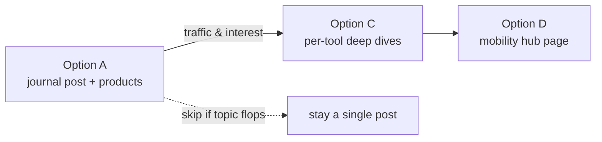
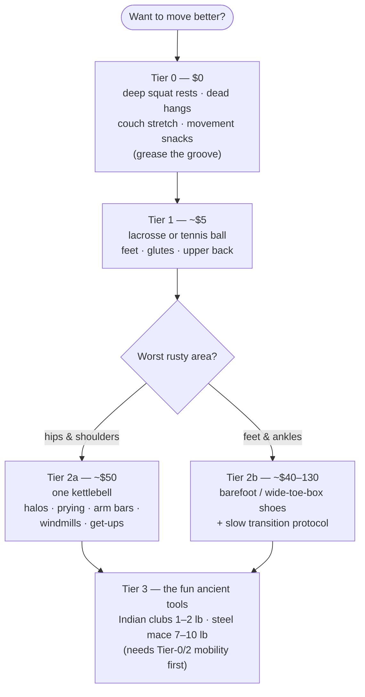
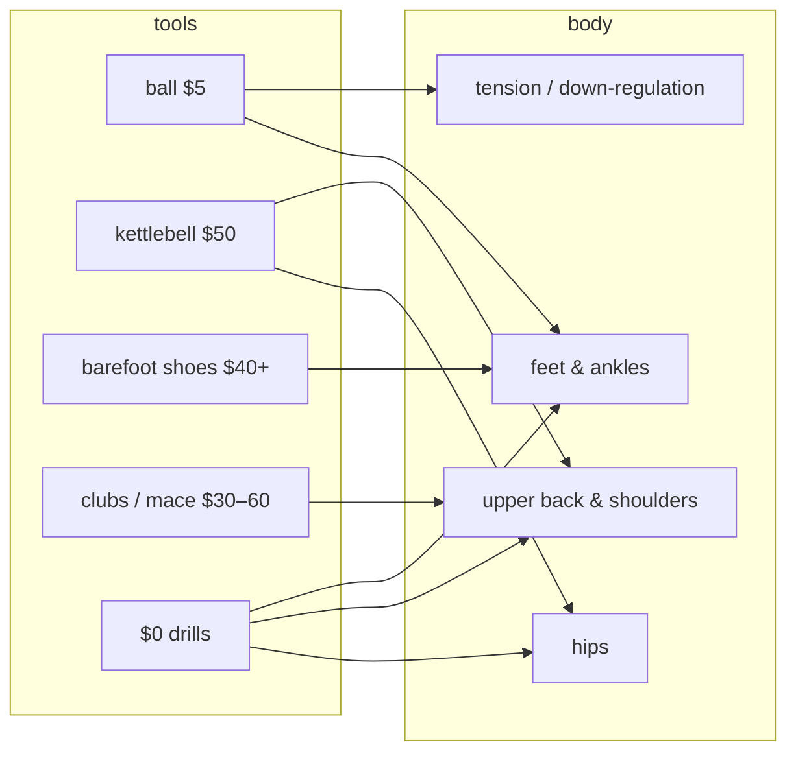

# Beginner Mobility Starter Kit — the cheapest honest way in

## Problem Statement

Floor Life tells people to live closer to the ground, but getting *down* there
(and back up, comfortably) takes hips, ankles, and shoulders that most desk
workers have let rust. The site currently covers positions, gear for sitting,
and the "why" — but there is no on-ramp for **mobility practice itself**.

The idea (from the prompt): a post or page about *really easy* ways to get
started with mobility, built around cheap, single-purchase tools —

- one kettlebell (halos, goblet prying, arm bars, windmills, get-ups),
- Indian clubs, or a steel mace,
- a tennis/lacrosse ball for rolling out tight tissue,
- barefoot / wide-toe-box shoes,

plus the zero-dollar stuff (deep squat rests, hanging, couch stretch, movement
snacks) that is maximally on-brand for this site.

Open questions this exploration answers:

1. What should the content actually say — and how do we stay evidence-honest
   (especially about "fascia release" and barefoot-shoe claims)?
2. What format fits the repo: journal post, dedicated page, or both?
3. Where does the gear live — inline links or `products.json` entries with
   cards and affiliate links like the rest of the site?
4. How does it differentiate from Kelly Starrett / GMB / Katy Bowman et al.?

## Executive Summary

**Recommendation: ship one long-form journal post — "The $0-to-$50 mobility
starter kit" — backed by real gear entries.** Concretely:

- A `category: guide` journal post in `src/content/journal/` organized as a
  **price ladder**: $0 (squat rests, hanging, couch stretch, movement snacks)
  → ~$5 (lacrosse ball) → ~$50 (one kettlebell OR barefoot shoes) → ~$30–$60
  (Indian clubs or a steel mace, the "fun weird tools" tier).
- Extend `products.json` with a new `mobility` category (5–6 entries:
  kettlebell, lacrosse ball set, Indian clubs, steel mace, budget + premium
  barefoot shoes) so the gear gets `ProductCard` treatment on `/gear` and can
  carry affiliate links — the site's existing monetization seam.
- Add 4–6 entries to `resources.json` (Simple & Sinister, Mark Wildman, GMB
  hanging guide, and the key studies as `kind: research`).
- **Differentiator: evidence honesty.** Say plainly that ball-rolling works
  via the nervous system (not by "melting fascia"), that its ROM gains are
  real but temporary, and that barefoot-shoe foot-strength gains are
  promising but low-certainty — and pair them with the documented transition
  injuries. Nobody else in this niche leads with calibrated claims; it fits
  the site's existing tone ("what floor living can't do" already exists).

The mobility content is a natural bridge between the site's *positions*
(which demand mobility) and its *gear* (which currently stops at props).

## Current State In The Repository

- **Journal collection** — `src/content.config.ts` defines `journal` with
  `category: z.enum(['science', 'guide', 'gear', 'story'])`, `tags`,
  `sources` (label + URL pairs), `featured`. Four posts exist in
  `src/content/journal/`, e.g. `the-sitting-rising-test.md` and
  `floor-cushions-and-benches-what-to-buy.md` — the latter is the closest
  stylistic template: short, opinionated, buying-guide voice.
- **Products collection** — `src/data/products.json` with schema in
  `src/content.config.ts`: `category` is currently
  `z.enum(['seating', 'desk-chair', 'desk', 'sleeping', 'flooring', 'props'])`.
  **There is no mobility-tools category** — the enum and the `categories`
  array in `src/pages/gear.astro` both need a new `mobility` entry. The
  existing `props` category ("Small things that unlock deep positions and
  easier get-ups") is adjacent but scoped to floor-sitting props (slant
  boards, etc.), not training tools.
- **Gear page** — `src/pages/gear.astro` renders per-category sections from
  a `categories` const, with an FTC disclosure block above the links and
  `ProductCard` / `ComparisonTable` components
  (`src/components/ProductCard.astro`, `src/components/ComparisonTable.astro`).
- **Resources collection** — `src/data/resources.json`, rendered by
  `src/pages/resources.astro`, `kind: 'community' | 'watch' | 'reading' |
  'research'` — perfect slots for Wildman videos (`watch`), S&S (`reading`),
  and the foam-rolling/barefoot studies (`research`).
- **Positions** — `src/data/positions.json` entries carry `demands` (e.g.
  ankle/hip mobility) and `props`; the post should link positions ↔ drills
  (e.g. goblet prying → deep squat position page).
- **Affiliate infrastructure** — `src/components/AffiliateLink.astro`,
  `src/pages/disclosure.astro`; per project memory, affiliate tags are still
  TODO, so new product entries should follow the existing pattern (real
  retailer URLs, tags added later).
- **Supporting components** — `Callout.astro` (safety caveats),
  `Figure.astro` (illustrations), `SectionHeader.astro`; journal already
  renders reading time via `remark-reading-time.mjs`.

## External Research

Full research notes summarized here (agent-collected, mid-2026 prices).

### The tools

| Tool | Entry cost | What it's for | Starter size |
|---|---|---|---|
| Tennis/lacrosse ball | $0–$8 | Feet, glutes, upper-back rolling; nervous-system down-regulation | any |
| One kettlebell | $40–$60 (Yes4All/Amazon Basics, ~$1.5–2.6/lb) | Halos, goblet prying, arm bars, windmills, Turkish get-ups | Men 12–16 kg (8 kg for drills), women 6–8 kg |
| Indian clubs | $25–$60/pair | Shoulder circles, rotator cuff, wrist/grip, rhythm | 1–2 lb per club |
| Steel mace | $30–$45 (Yes4All 10 lb) | 360s, 10-to-2s — long-lever shoulder work | Men 10–15 lb, women 7–10 lb |
| Barefoot shoes | $40 (Whitin) → $90–130 (Xero, Lems) → $130–180 (Vivobarefoot) | Toe splay, foot strength, ground feel | n/a |
| Doorway pull-up bar | $20–$30 (or a playground) | Dead hangs — shoulder decompression, grip | n/a |

### What the evidence actually supports (the honesty layer)

- **Ball/foam rolling:** acute ROM gains are real but modest (~4–10%) and
  short-lived; mechanism is almost certainly **neurological** (stretch
  tolerance, pain modulation, reflex excitability), *not* physical fascia
  deformation. Konrad et al. 2022 (*Sports Medicine* 52:2523–2535, systematic
  review/meta-analysis); Wiewelhove et al. 2019 (*Frontiers in Physiology*
  10:376) — modest DOMS/recovery benefit, negligible performance effect.
  **Do not roll the IT band expecting length change** — it's anchored to the
  femur and far too stiff to deform under body weight; work the TFL/glutes/
  quads instead.
- **Barefoot shoes:** Univ. of Liverpool 2021 (*Scientific Reports*): ~6
  months of daily minimal footwear → **+57% intrinsic foot muscle strength**
  with no targeted exercise. A 2022 systematic review (PubMed 35878616)
  confirms the direction (strength +9–57%) but rates certainty **low to very
  low**. Counterweight: Ridge et al. 2013 (*MSSE*, BYU) — 10 of 19 runners
  transitioning to minimal shoes over 10 weeks developed foot bone-marrow
  edema vs 0 of 17 controls. → The transition protocol (30 min/day walking,
  6+ weeks before any running, 2–3 months total) is not optional content.
- **Deep squat resting:** Hewes 1955 (*American Anthropologist* 57:231–244) —
  roughly a quarter of humanity habitually rests in a flat-foot deep squat;
  it's the chair-culture exception, not the squat, that's unusual. Extremely
  on-brand citation for this site.
- **Steel mace nuance:** the mace doesn't *grant* shoulder mobility — you
  need baseline ROM to swing it safely (else you compensate through the
  lumbar spine). Position it as the *reward/reinforcement* tier, not the
  entry point (Cavemantraining's "shoulder mobility myth" argument).
- **Kettlebell caveat:** the swing is a hinge with a real learning curve;
  get-ups should be learned unloaded (balance a shoe on the fist) before
  adding the bell. Canonical minimalist program: Pavel Tsatsouline,
  *Kettlebell Simple & Sinister* (StrongFirst) — one bell, two movements.

### Prior art and the gap

Starrett/The Ready State (performance-tilted, athlete pedigree), GMB Fitness
(skill/bodyweight, great free hanging + desk-mobility guides), Katy Bowman /
Nutritious Movement (movement-diet philosophy — the closest ideological
neighbor), Original Strength (ground-based resets), Squat University
(clinical/lifter). **The gap:** nobody offers a single, price-laddered,
evidence-calibrated "cheapest way in" for sedentary adults that ties every
tool back to floor living. That's the post.

## Key Findings

1. **The price ladder is the natural spine of the piece.** $0 → $5 → $50 →
   fun-weird-tools maps cleanly to effort and commitment, and it front-loads
   the on-brand free stuff (squat rests, hanging, couch stretch) before any
   purchase — which builds trust ahead of affiliate links.
2. **One kettlebell and barefoot shoes are peers, not sequels** — both sit at
   the ~$40–$60 tier and serve different bodies (shoulders/hips vs feet).
   The post should frame them as "pick the one that matches your worst
   joint," not a sequence.
3. **Clubs and mace belong in one shared "ancient tools" tier.** Same
   movement family (circular shoulder work), same instructors (Mark
   Wildman), and the mace explicitly requires baseline mobility — so this
   tier comes *after* the basics, which conveniently matches its higher
   novelty/lower necessity.
4. **The repo needs one schema change, not a new system.** Adding
   `'mobility'` to the products `category` enum plus a `categories` entry in
   `gear.astro` reuses all existing card/table/disclosure machinery.
5. **Evidence honesty is the differentiator and the site already has the
   voice for it** (`what-floor-living-cant-do.md`). "Fascia release" language
   in the prompt should be gently corrected *in the content itself* — that's
   the post's credibility engine, not a buzzkill.

## Options And Tradeoffs

### A. One journal post (guide) + product entries — **recommended**

- ✅ Fits existing collections and voice; ships in one PR.
- ✅ Journal posts get RSS, search, tags, reading time for free.
- ✅ Product entries put the gear on `/gear` where buyers already are.
- ➖ Long post (~2,500 words) — mitigate with strong H2 structure and the
  ladder as a table of contents.

### B. Dedicated page (`src/pages/mobility.astro`) like `/start`

- ✅ Room for custom layout (tier cards, decision flow), permanent nav slot.
- ➖ New page template to design/maintain; nav is already six items;
  premature before we know the content resonates.
- ➖ Pages don't flow into the journal RSS/tag system.

### C. Series of per-tool posts (kettlebell post, barefoot post, …)

- ✅ Each post can go deep; good long-tail SEO per tool.
- ➖ Fragments the "one honest overview" value prop; slower to first value.
- ✔ Best as **phase 2**: the starter-kit post links out to deep dives as
  they're written (the get-up alone deserves its own post — it is literally
  a floor-to-standing practice).

### D. Hub page + series (B + C)

- The eventual end-state if mobility becomes a site pillar, but overkill for
  validating the topic. Start with A, promote to D later if traffic says so.



### Content-structure choice within Option A

The ladder beats an alphabetical tool survey because it answers the reader's
actual question ("what should I do/buy *first*?"):



And the tool→benefit map the post can render as a simple table:



## Recommendation

Ship **Option A** in one PR:

1. **Post:** `src/content/journal/mobility-starter-kit.md` — working title
   *“The $0-to-$50 mobility starter kit”*, `category: guide`,
   `tags: ["mobility", "gear", "getting started"]`, `featured: true`,
   full `sources` array (Konrad 2022, Wiewelhove 2019, Sci Reports 2021,
   Ridge 2013, Hewes 1955, S&S, GMB hanging guide). Structure = the tier
   ladder above; every tier ends with "do this today" (one drill, sets/time).
   Safety `Callout`s: kettlebell form-before-load, mace-needs-mobility,
   barefoot transition, don't-roll-the-IT-band.
2. **Schema/gear:** add `'mobility'` to the products enum in
   `src/content.config.ts`; add a `mobility` section to `gear.astro`
   (blurb: cheap tools that buy back range of motion); add ~6 entries to
   `products.json` (Yes4All kettlebell · lacrosse ball 2-pack · wooden
   Indian clubs 1–2 lb · Yes4All 10 lb mace · Whitin budget barefoot shoe ·
   Vivobarefoot/Xero premium pick), tiered budget/mid/premium with honest
   cons ("mace requires shoulder ROM you may not have yet").
3. **Resources:** add S&S (`reading`), Mark Wildman + GMB hanging
   (`watch`/`reading`), Konrad 2022 + Ridge 2013 + Hewes 1955 (`research`)
   to `resources.json`.
4. **Cross-links:** from the post to relevant position pages (deep squat,
   kneeling) via `demands`, and from `start.astro`/`cheatsheet.astro` if a
   one-line pointer fits naturally.

Phase 2 (separate explorations/PRs, only if warranted): Turkish get-up deep
dive (peak on-brand: it *is* floor-to-standing), barefoot transition guide,
mobility hub page.

## Example Code

`src/content.config.ts` — one-line enum extension:

```ts
category: z.enum([
  'seating',
  'desk-chair',
  'desk',
  'sleeping',
  'flooring',
  'props',
  'mobility',   // ← new: training tools (kettlebell, clubs, mace, balls, footwear)
]),
```

`src/pages/gear.astro` — new section entry:

```ts
{ key: 'mobility', title: 'Mobility tools', blurb: 'One ball, one bell, maybe a club — cheap tools that buy back the range your chair took.' },
```

`src/data/products.json` — example entry shape (matches existing schema):

```json
{
  "id": "yes4all-kettlebell-16kg",
  "name": "Powder-Coated Kettlebell (16 kg / 35 lb)",
  "brand": "Yes4All",
  "category": "mobility",
  "price": "$45–$55",
  "priceNote": "Buy by the kilo: 8 kg for drills, 16 kg if you'll also swing.",
  "affiliateUrl": "https://www.walmart.com/ip/Yes4All-8kg-18lb-Powder-Coated-Kettlebell-Single/287969962",
  "retailer": "Walmart / Amazon",
  "tier": "budget",
  "pros": [
    "One bell covers halos, prying squats, arm bars, windmills, and get-ups for months",
    "Powder coat grips well without chalk",
    "Cheapest cost-per-decade of any training tool"
  ],
  "cons": [
    "The swing and get-up have a real learning curve — learn them unloaded first",
    "Cast iron and your floor need to reach an understanding (a mat helps)"
  ],
  "bestFor": "Desk workers whose hips and shoulders are the rusty part.",
  "verdict": "The single best $50 in fitness. Start lighter than your ego suggests.",
  "featured": true
}
```

Post frontmatter skeleton:

```yaml
---
title: "The $0-to-$50 mobility starter kit"
description: "Squat rests, a lacrosse ball, one kettlebell, maybe a pair of weird ancient clubs — the cheapest honest way to win back your range of motion."
pubDate: 2026-07-10
category: guide
tags: ["mobility", "gear", "getting started"]
featured: true
sources:
  - label: "Konrad et al. 2022 — foam rolling & ROM meta-analysis (Sports Medicine)"
    url: "https://link.springer.com/article/10.1007/s40279-022-01699-8"
  - label: "Ridge et al. 2013 — minimal-shoe transition bone edema (MSSE)"
    url: "https://pubmed.ncbi.nlm.nih.gov/23439417/"
  - label: "Hewes 1955 — world distribution of postural habits (American Anthropologist)"
    url: "https://anthrosource.onlinelibrary.wiley.com/doi/10.1525/aa.1955.57.2.02a00040"
---
```

## Risks And Open Questions

- **Health-claim liability/tone.** The site isn't medical; keep claims
  calibrated (the research summary above already is) and reuse the existing
  disclaimer patterns. The IT-band and barefoot-transition warnings are
  must-keeps.
- **Affiliate program gaps.** Kettlebells/maces (Yes4All via Walmart/Amazon)
  fit Amazon Associates once tags land (memory: tags still TODO); Vivobarefoot
  and Xero run their own affiliate programs — worth checking before choosing
  which barefoot brands get cards vs plain links.
- **Prices drift.** Follow the existing convention: price ranges +
  "check the current price at the link" disclosure already on `/gear`.
- **Scope creep risk.** The get-up, barefoot transition, and club swinging
  each deserve their own posts — the starter kit must stay a survey with
  "do this today" bites, not five tutorials stapled together.
- **Open question:** does `featured: true` on a fifth journal post crowd the
  homepage? Check how `index.astro` selects featured content before setting.
- **Open question:** illustrations — `PositionArt.astro`/`Figure.astro`
  exist; do we want simple line art per tier (kettlebell halo, deep squat,
  ball-on-foot)? Nice-to-have, not blocking.

## Implementation Checklist

- [x] Add `'mobility'` to products `category` enum in `src/content.config.ts`
- [x] Add `mobility` section (key/title/blurb) to `src/pages/gear.astro`
- [x] Add ~6 mobility products to `src/data/products.json` (kettlebell,
      lacrosse ball, Indian clubs, steel mace, budget + premium barefoot
      shoes) with honest pros/cons and tier spread
- [x] Write `src/content/journal/mobility-starter-kit.md` using the tier
      ladder: $0 drills → ball → bell-or-shoes → clubs/mace, each tier ending
      with a "do this today" action
- [x] Include safety callouts: kettlebell form-before-load, unloaded get-up
      progression, mace-requires-baseline-ROM, barefoot transition protocol,
      don't-roll-the-IT-band
- [x] Fill `sources` frontmatter with the key citations (Konrad 2022,
      Wiewelhove 2019, Sci Reports 2021, Ridge 2013, PubMed 35878616,
      Hewes 1955)
- [x] Add resource entries to `src/data/resources.json`: Simple & Sinister
      (`reading`), Mark Wildman kettlebell/mace playlists (`watch`), GMB
      hanging guide (`reading`), 2–3 studies (`research`)
- [x] Cross-link the post ↔ deep-squat / kneeling position pages
- [x] Verify featured-post behavior on `index.astro` before setting
      `featured: true`
- [x] Check Vivobarefoot/Xero affiliate programs; otherwise plain links per
      existing convention

## Validation Checklist

- [ ] `npm run build` passes (content schema validates, including the new
      enum value and post frontmatter)
- [ ] `/gear` renders the new "Mobility tools" section with product cards and
      the FTC disclosure still above all links
- [ ] `/journal` lists the post with correct category badge, tags, and
      reading time; post page renders callouts and sources block
- [ ] Post appears in RSS (`/rss.xml`) and site search
- [ ] `/resources` shows the new entries under the right kinds
- [ ] All external URLs resolve (retailer links, study links)
- [ ] Read-through check: every purchase tier is preceded by a free
      alternative, and every strong claim carries its caveat

## References

- Konrad A, Nakamura M, Tilp M, et al. (2022). "Foam Rolling Training Effects
  on Range of Motion: A Systematic Review and Meta-Analysis." *Sports
  Medicine* 52:2523–2535. <https://link.springer.com/article/10.1007/s40279-022-01699-8>
- Wiewelhove T, et al. (2019). "A Meta-Analysis of the Effects of Foam
  Rolling on Performance and Recovery." *Frontiers in Physiology* 10:376.
- Wilke J, et al. (2020). Foam rolling meta-analysis, *J Bodywork & Movement
  Therapies*. PubMed 32825976.
- Ridge ST, et al. (2013). "Foot Bone Marrow Edema after a 10-wk Transition
  to Minimalist Running Shoes." *MSSE*. <https://pubmed.ncbi.nlm.nih.gov/23439417/>
- Univ. of Liverpool (2021). "Daily activity in minimal footwear increases
  foot strength." *Scientific Reports*.
- Systematic review (2022) on minimalist footwear and intrinsic foot muscle
  strength. <https://pubmed.ncbi.nlm.nih.gov/35878616/>
- Hewes GW (1955). "World Distribution of Certain Postural Habits."
  *American Anthropologist* 57(2):231–244.
- Tsatsouline P. *Kettlebell Simple & Sinister* (StrongFirst).
  <https://www.strongfirst.com/shop/books/simple-sinister-book/>
- GMB Fitness hanging guide <https://gmb.io/hanging/> and desk mobility
  routine <https://gmb.io/desk-mobility/>
- Cavemantraining, "The Steel Mace Shoulder Mobility Myth."
  <https://www.cavemantraining.com/cavemantraining/steel-mace-shoulder-mobility-myth/>
- Art of Manliness, "An Introduction to Indian Club Training."
  <https://www.artofmanliness.com/health-fitness/fitness/an-introduction-to-indian-club-training/>
- Anya's Reviews — barefoot shoe brand/fit comparisons.
  <https://anyasreviews.com/10-best-barefoot-running-shoes-for-healthy-feet/>
- Mark Wildman (YouTube) — kettlebell, club, and mace beginner progressions.
